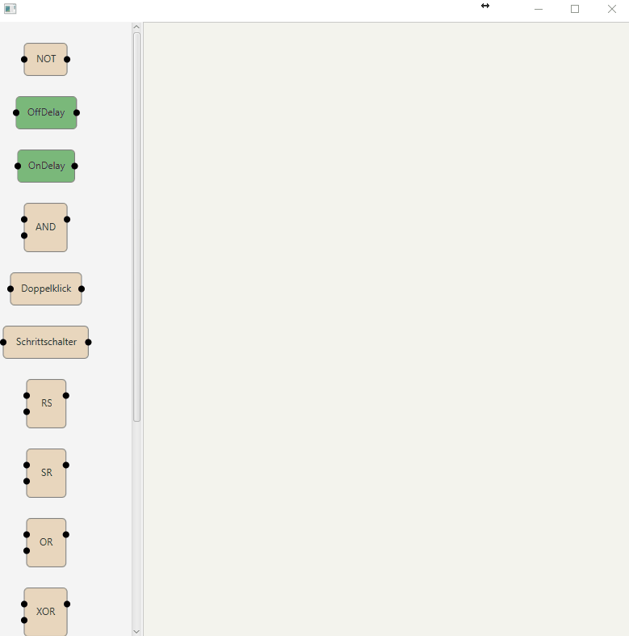

# GPI - Graphical Programming Interface

  

## Table of content

- [Why](#Reasoning)
- [Goals](#Goals)
- [Installation](#Installation)
- [Current Status](#Current Status)
  - [Work done](#Work-done)

## Why

This project started out as a personal endavour to get to know Java better, as well as learn some concepts in terms of programming. 
I always wanted something that I could quickly programm to try out stuff, or enhance with real coding. This idea came to me after seeing a buddy work with Node.RED and several projects I realised in CodeSys. 
For me, CodeSys is how most systems in terms of Automation and Programming should work: Users with the right skillset can create their own blocks using normal programming, whilst users who are not found of programming can do it with the blocks.

## Goals

I've defined several Goals for this Project.

* Create an OpenSource Graphical Logic Editor that can:
  - Enable others to adapt it to their Language trough user submitted translations
  - Enable the creation of new Blocks trough easy-to-use extension of existing classes, which have all the hard work done
  - Enable the User to save Logics
  - Implement the Concept of MVC so that others can implement the underlying Logic structure without much of a hassle
* Create an OpenSource Server-Applet for the SaveFile that can:
  - Run the SaveFile without much overhang on stand alone devices, like a RPi
  - Allow debugging access to it trough a webpage (jetty, for example)
* Personal Goals I'd like to fullfill:
  - Allow teachers to use this Tool in terms of teaching people about programming
  - Include extensive Documentation about all the issues I had, as well as the Design choices I made
  - Extensive Documentation about how to create new Blocks

## Installation

This project is far from finished and is not yet intended for usage. You can fork it and compile it, but I cannot guarantee it'll work.

## Current Status

Currently I am rewriting most of my Code to adapt the MVC Concept. This is likely the 2nd time I am rewriting a huge portion of the code, so beware of that when forking.

### Work done

* Converting to MVC
 - Programming: 30% done
 - Testing:      0% done
* Enabling Localization
 - Programming: 40% done
 - Testing:      5% done
 * Creating a Savefile
  - Programming: 0% done
  - Testing:     0% done

