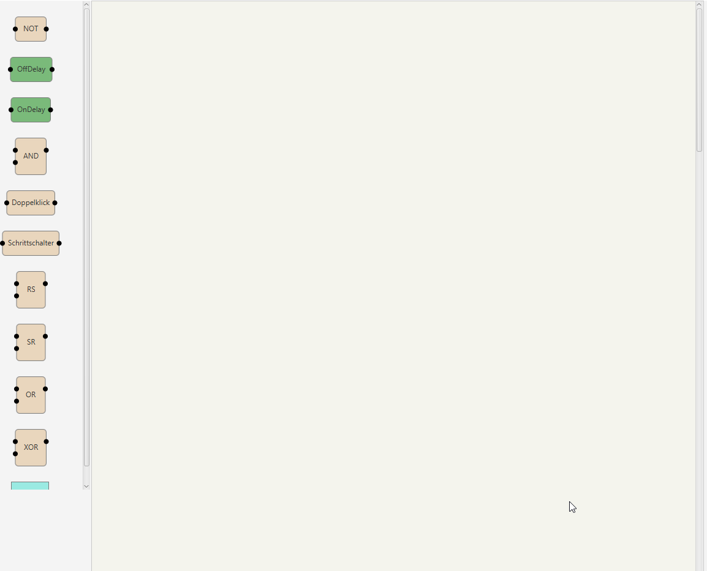

# GPI - Graphical Programming Interface

This Project is supposed to turn into a fully modular and user extendable Graphical Programming Interface. 
Everything is ready to go for you to write your own Blocks. Timer, Logic, Filter, Variable... extend the correct Interface, implement the needed functions and watch it go!

Currently this Project is a rough Concept.

In the end, its supposed to look something like Node.RED. Ofcourse it wont be the same thing...I think. 

  

